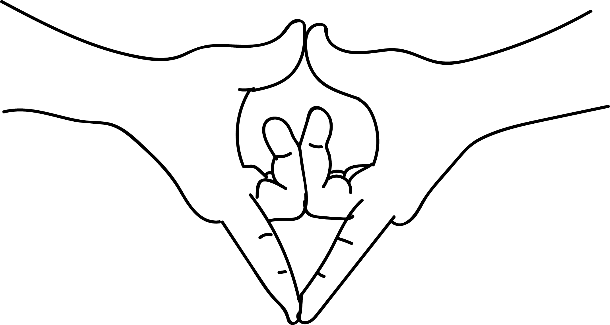

# Yoni Mudra

[TOC]

**Yoni Musdra** is specially designed for women. The posture of this mudra is held at the level of abdomen. **Yoni Musdra** means the womb or source and mudra a seal.

## Formation
Join the thumbs and the index fingers. Interlock the other fingers. The thumbs will be facing upwards and the index fingers will be facing downwards.
This can also be performed the other way shown in the picture.

## Effects
As the thumbs and index fingers touch each other they reflect volume of heat and air waves. Other fingers remain interlocked would solve the problems of the womb.

## Benefits
1. From the age of about thirteen girls have their periods and they get pain in the lower abdomen. Performing this mudra only for 5-10 minutes relieves the pain.
1. Scanty or excess bleeding will be regulated.
1. Practising this mudra every day for 10 minutes followed by prana mudra will solve the menopause related problems.

## References

## References

1. **"MUDRAS & HEALTH PERSPECTIVES"** by ***"SUMAN.K.CHIPLUNKAR"*** page no 76
