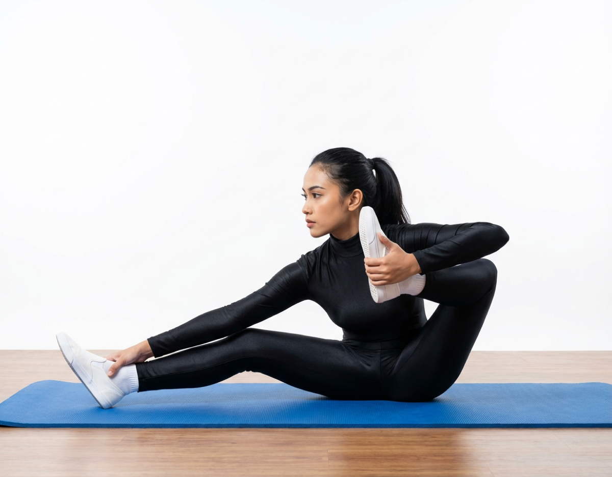

# Ākarṇa Dhanurasana

[TOC]

 Dhanurasana*]]

**[Ākarṇa](../Ākarṇa.md) Dhanurasana** in translation from Sanskrit Karṇa means ear and the prefix A means towards or near. Dhanu means "bow" and asana means "pose", the name literally translated is towards the ear bow pose. A better, non literal translation is the "Archer Pose" as the position resembles an archer about to release an arrow.

## Technique
1. Sit down upright, stretch out your legs, keep the legs close together,the palms will have to be placed on the ground on both the sides.
1. Bend the right knee, cross the left leg, place the right heel on the floor, the right heel will have to lie beside the left ankle on the ground.
1. Grasp your right toe with the left thumb, middle and index fingers. at the same time, catch hold of the left toe with the right thumb, middle and index fingers, Slowly inhale deeply.
1. Keep the head erect.
1. Pull up the right foot till your right knee is beside the right armpit and even as the right toe touches the left ear. at this time the right hand should be pulling the left toe.
1. As you pull the toes concentrate your gaze at the toe of the outstretched leg. (In this case, your eyes must be looking at the left toe).
1. Even as you exhale return the right foot to the ground on the left side of the outstretched left leg, release the hands. slowly stretch the legs side by side in front.
1. This completes the first part of the posture, complete the round by repeating the action on the other side.

## Technique in pictures/animation
## Effects
* It helps the make the legs strong and flexible.
* It helps to build up the core muscles.
* It also helps in the improvement of grace and concentration.
* It also helps to strengthen the abdominal muscles and the spine.
* It improves posture and removes the pain of back and lumbar region.
* It is considered to be beneficial for those who have arthritis and rheumatic condition.
* It improves the digestion process, treats indigestion problems and also clears constipation.

## Related Asanas
* [Ardha Matseyendrasana](../yoga/Ardha_Matseyendrasana.md)
* [Supta Padangusthasana](../yoga/Supta_Padangusthasana.md)

## Special requisites
Patients suffering from below mentioned conditions should avoid doing [Ākarṇa](../Ākarṇa.md) Dhanurasana
* Pregnancy
* Menstruation
* Shoulder injury
* Lumbar disk problems
* Hamstring injury

## Initial practice notes
The first beginner's tip for this pose is that you should not try it when you are alone, always do this in the company of some friends. Those who are doing it for the first time, their most common problem is that they face difficulty while lifting the thighs away from the floor. In this case they can give themselves a little upward boost by lying down with the thighs being supported by a rolled up blanket. The asana is of great benefits and helps to free the contract hands and legs as well as increasing the efficiency of the organs and making it stronger.

## References

## External Links
* [Akarna Dhanurasana on yoga.hosur online.com](http://yoga.hosuronline.com/Dhanurasana.asp)
* [Akarna Dhanurasana on yogajournal.com](https://www.yogajournal.com/practice/take-aim)
* [Akarna Dhanurasana on mudra guide.com](http://mudraguide.com/akarna-dhanurasana.html)

## References

1. [of Akarna Dhanurasana yoga"]("Methodology)(http://www.yogapositions.co.in/akarna-dhanurasana-yoga-pose-steps-benefits.html)
2. [tips"]("Beginers)(http://www.astrolika.com/yoga/akarna-dhanurasana.html)
3. ["Advantages"](http://mudraguide.com/akarna-dhanurasana.html)
